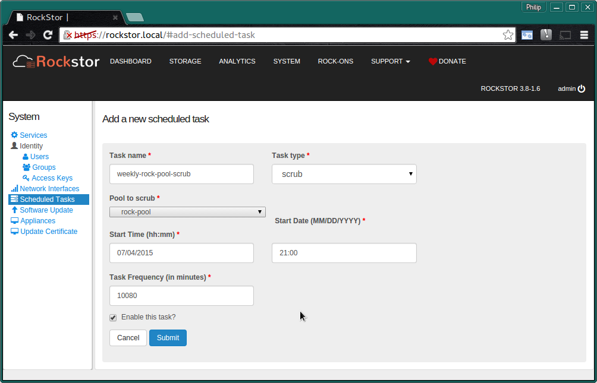
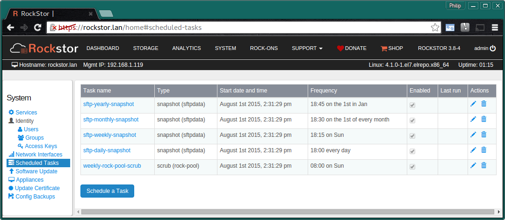

.. _tasks:

Scheduled Tasks
===============

Rockstor has the ability to set up scheduled tasks that are run at a specified
frequency eg:- every minute / 30 minutes, daily, weekly, monthly, or yearly;
and at a specified time in the case of lower frequencies.

The types of tasks currently supported are:-

* Pool scrub
* Share Snapshot 

.. _tasksenable:

Enable / Disable all Tasks
--------------------------

On the Web-UI **System** page under **Services** there is a **Task Scheduler**
switch which will enable or disable all tasks at once.

.. _newtask:

Creating a New Task
-------------------

To create a new task click the **Add Scheduled Task** button in the
**Scheduled Tasks** section of the **System** page; see the following sections
:ref:`scrubtask` and :ref:`snapshottask` for examples of creating tasks.

.. _scrubtask:

Create a Scrub Task
^^^^^^^^^^^^^^^^^^^

To create a scrub task enter the following:-

* **Task name** and **Task type** ie *scrub*
* **Pool to scrub** from the drop down
* **Frequency of task** ie how often and when

Then the **Submit** button.

.. _snapshottask:

Create a Snapshot Task
^^^^^^^^^^^^^^^^^^^^^^

To create a snapshot task enter the following:-

* **Task name** and **Task type** ie *snapshot*
* **Share** to snapshot
* **Snapshot prefix** the file name will be *prefix_YYYYMMDDHHMMSS*
* **Maximum count** keep only this number of the most recent snapshots
* **Frequency of tasks** ie how often and when

.. image:: mpsnapshot_daily.png
   :scale: 80 %
   :align: center

Then the **Submit** button.

.. _tasksedit:

Edit an Existing Task
---------------------

If you wish to Enable / Disable / Edit an **Existing task** use that task's
respective **pen icon** in the **Actions column** on the **System** page
**Scheduled Tasks** section.

And clicking on the **pen** of an **existing task** results in:-

.. image:: task_edit.png
   :scale: 80 %
   :align: center

Note the **Enable task?** tick box within this edit page.

.. _taskdelete:

Delete a Task
-------------

To delete a task, click the **Delete / bin** icon in that tasks **Actions**
column in the list of tasks available on the **System** page **Scheduled Tasks**
section.

