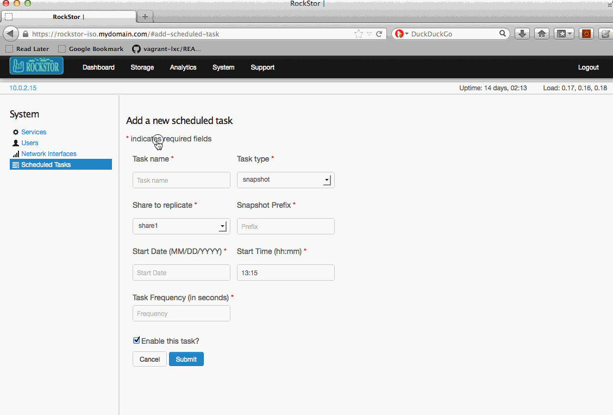
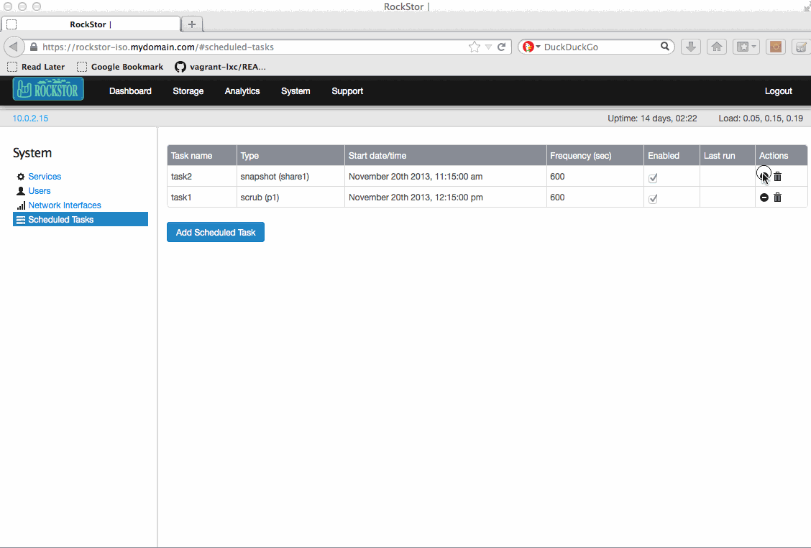
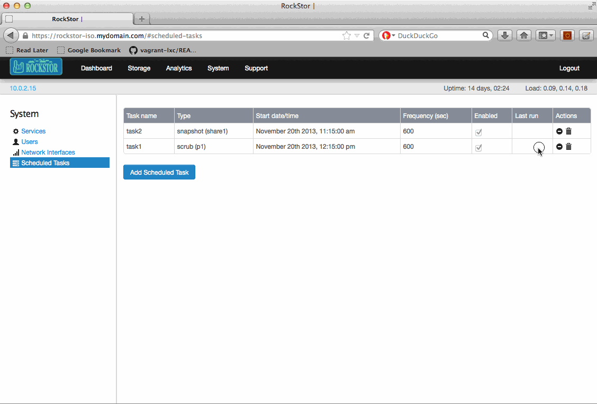

Scheduled tasks
===============

RockStor allows a user to set up scheduled tasks that start at a particular time
and are run at a specified frequency. Two types of tasks are supported currently

* Pool scrub
* Share Snapshot 

In the web-ui, click on *System* tab to go to the *System* view. Now click on
*Scheduled Tasks* in the left sidebar to go to the *Scheduled Tasks* view.
To create a new task, click the Add Scheduled Task button.

Create a scrub task
-------------------

To create a pool scrub task select the task type as **scrub**. Select the pool
to scrub from the dropdown list of pools, enter a start date and start time, 
enter the task frequency in seconds, and submit the task as shown below.

Create a snapshot task
----------------------

To create a snapshot task select the task type as **snapshot**. Select the share
that should be snapshotted, enter a prefix (The snapshot will be given an
auto-generated name with this prefix), enter a start date and start time, enter
the task frequency in seconds, and submit the task as shown below.

Enable / Disable a task
-----------------------

In the web-ui, click on *System* tab to go to the *System* view. Now click on
*Scheduled Tasks* in the left sidebar to go to the *Scheduled Tasks* view.

In the list of scheduled tasks, the **enabled** checkbox shows whether the task
is currently enabled or not. To disable a currently enabled task, click the
**disable** icon in the corresponding row in the list of tasks, and similarly to
enable a disabled task, click the **enable** icon.

Delete a task
-------------

In the web-ui, click on *System* tab to go to the *System* view. Now click on
*Scheduled Tasks* in the left sidebar to go to the *Scheduled Tasks* view.

To delete a task, click the **Delete** icon in the corresponding row in the list
of tasks.

