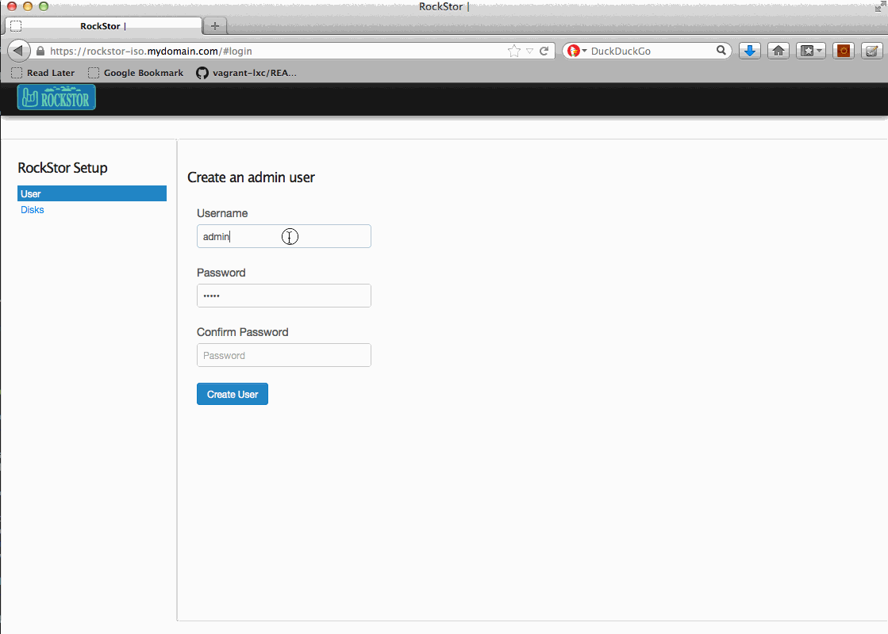

User Interfaces
===============
RockStor supports multiple ways for a user to interact
with the appliance. It supports operations through a browser based
interface (Web UI), a command line interface (CLI) that can be used for
scripting common operations, or a RESTful API that enables complete
programmatic control of the appliance.

.. _webui:

Web UI
------

The RockStor browser based interface or web-ui is supported on the Firefox
web browser.

The initial setup of the appliance should be done through the
Web UI, and once it is completed, any of the supported interfaces can be used
to interact with it.

.. _setup:

Setup
^^^^^

Once RockStor installation is finished as described in the
:ref:`installation` section, the new appliance can be setup by visiting
https://<appliance_ip> using the Firefox browser.

The setup process consists of two screens. In the first screen, an admin user
must be created by entering desired credentials. In the second screen, all
disks detected in the system are displayed. Click next to finish the setup
process as shown below.

Once the setup process is complete, the newly created admin user is logged in
and the Rockstor dashboard is displayed.

.. _cli:

CLI
---

RockStor provides a command line interface that can be used by a user to
administer the appliance, or used for scripting to automate repetitive
tasks.

To access the CLI, ssh to the appliance as an admin user. The CLI is structured
as a collection of subconsoles and the user is placed in the main console.

At any point in the CLI, entering 'help' or '?' prints a list of available
commands.

.. image:: cli.png
   :align: center

The subsections and commands will be further explained in the corresponding
sections of the documentation that they are related to.

.. _api:

API
---

Coming soon...

