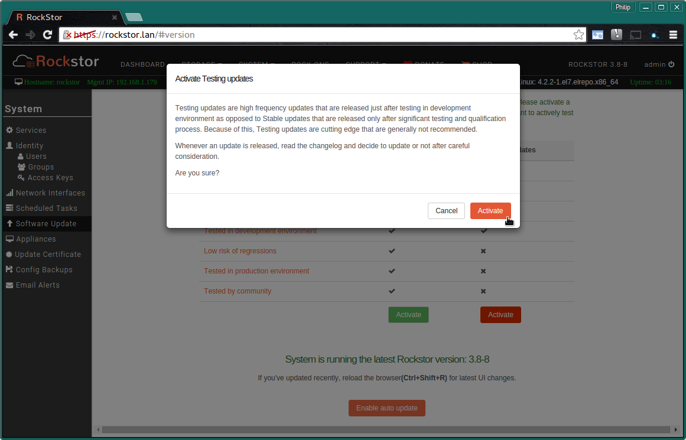
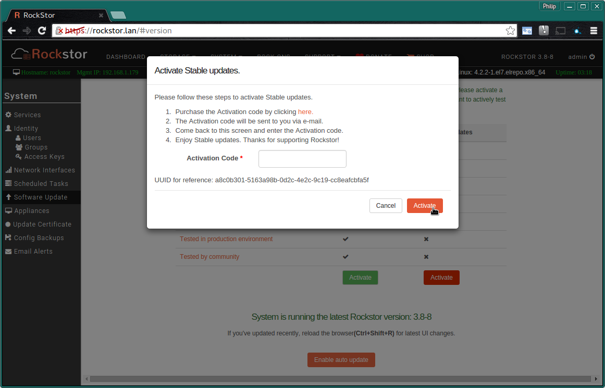
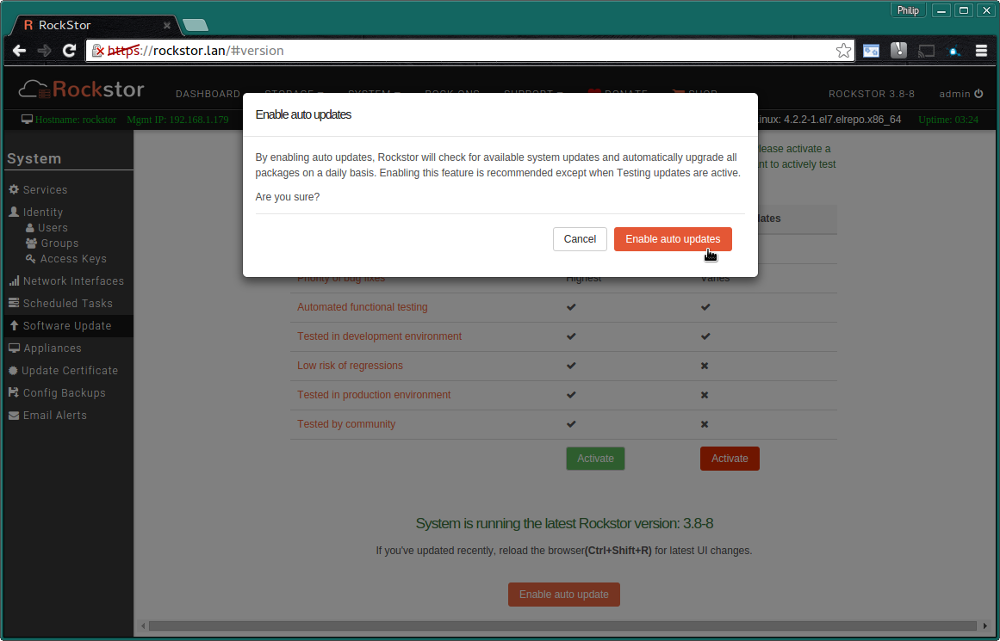

.. _update_channels:

Update Channels
===============

.. _rockstor_licence:

GNU GPLv2 Licenced
------------------

The code that makes Rockstor possible is developed under the
`GNU GPLv2 <https://www.gnu.org/licenses/old-licenses/gpl-2.0.html>`_ licence
and is therefore fully Open
Source, there is no contributor agreement and everyone is encouraged to help in
what ever way they can. It is very much developed in the open with key
decisions made by the community and their interaction with Rockstor
representatives such as it's founder and project lead
`Suman Chakravartula <http://rockstor.com/about-us.html>`_. This flow of ideas
and open development is held as a founding principal and is instantiated in the
`Rockstor forum <http://forum.rockstor.com/>`_ and within the code itself
`on GitHub <https://github.com/rockstor>`_.

`Rockstor <http://rockstor.com/>`_ the company
embodies an identifiable software distributor and coordinator of the Open Source
product that is the scheduled Rockstor releases. It is also the legal entity
necessary for the support of not only the releases (where appropriate) but also
the infrastructure necessary to maintain the open development that is an
essential component in modern non trivial software appliances that have any
hope for qualifying as **future-proof**.

After an initial development of 2.5 years the sustainable nature of this
endeavour was approached and redressed in `a thread on the community forum
<http://forum.rockstor.com/t/would-you-pay-a-one-time-charge-for-stable-updates/448/21>`_.
The consensus was to adopt a two teared updates model; testing and stable.

..  image:: update_channel_options.png
    :align: center

The **update alternatives** offered in Rockstor.

.. _testing_channel:

Testing Channel
---------------

The testing channel for updates is intended for those who wish to **actively
test Rockstor** and who are entirely happy on the developmental edge of
releases. There is an ever growing
`automated test coverage <http://coverage.rockstor.com/>`_ that all testing
updates will have to pass prior to their release but given the rapid nature
of these releases **every 2-3 days** it is not recommended to put production
systems on this update channel. But the flip side is that a rapid release
cycle affords rapid development and more wide spread field testing of what
ultimately becomes the :ref:`stable_channel`.

However it must be understood that appliance development is a difficult
business and it is inevitable that along the way fixing one thing will break
another. All reasonable efforts will be made to avoid breakage in the testing
channel but ultimately this testing channel is intended to find problems by
way of user reports so that they might be fixed in a timely fashion and
hopefully avoided all together in future releases on the stable channel.

Participation in the testing channel along with considered bug, code, or
documentation contributions is the heart of Rockstor development and along
with patience and understanding can only benefit all those involved. Please
see :ref:`additional benefits <free_stable>`.

**No charge**

There is really no better testing alternative than thousands of users putting a
product to uses that were never envisaged by the developers; and when those
users see rapid development in the problems they find and report, everybody
wins. It's the classic *Bazaar* model described in `CatB
<https://en.wikipedia.org/wiki/The_Cathedral_and_the_Bazaar>`_.

.. _stable_channel:

Stable Channel
--------------

This is the recommended channel for **Production Rockstor use**, the frequency
of updates are much less(**every 3-4 weeks**) than those in the
:ref:`testing_channel` and there is the reassurance that update in the stable
channel have been field tested first on systems running on the testing channel
including the production systems powering various day to day operations of
project. This channel will receive the highest attention with regard to bug
fixes where as the testing channel is more focused on development rather than
refinement. There will also be greater attention paid to avoiding regressions,
and via partner programs, production environment testing prior to release should
help to ensure this channel's greater stability and dependability.

Below we see the process involved in setting up the stable channel updates. A
link is provided to the Rockstor shop where a variety of one off charge options
are available via a drop down. On selecting and purchasing one of the options
the activation code will be emailed to the address given. This code is intended
for the form shown below. Also note our :ref:`email_test` section where
the appliance id, a UUID generated during install, is contained within the test
email. This appliance id is used to identify an install as qualifying for the
stable channel.

N.B. re-installs will require re-activation of the stable channel however every
reasonable effort will be made to accommodate, via email (support@rockstor.com),
the transfer of an existing stable registered appliance id / UUID to that of
a re-installed system. Please be patient as the practice of this method
improves response time.

Participation in the stable channel is key to the future of Rockstor
development. The ability to continue to improve and provide future-proof
services by way of advanced file system facilities made easy is dependant on a
financial component. The stable channel is that financial component. Currently,
users can purchase a one year subscription for $15.00 USD or a five year
subscription for $35.00 USD.

**Variable one off charge depending on duration**

.. _free_stable:

Please note that any code or documentation contributions to the `Rockstor
project repositories <https://github.com/rockstor>`_ makes the contributor
eligible for unlimited Activation codes.

.. _auto_updates:

Auto Updates
------------

When enabled, **auto update** checks for all system updates and installs them
automatically on a daily basis. This is the **recommended** setting when on the
:ref:`stable_channel` only. If you are on the :ref:`testing_channel` it is not
recommended to enable auto updates but instead to evaluate all updates prior to
applying them; this advise is down to the more unstable nature of
the testing channel and it's inevitably greater chance of breakage or bugs.

**N.B. Auto updates are only recommended when on the stable updates channel**
