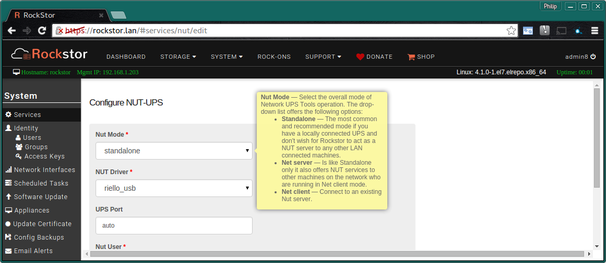
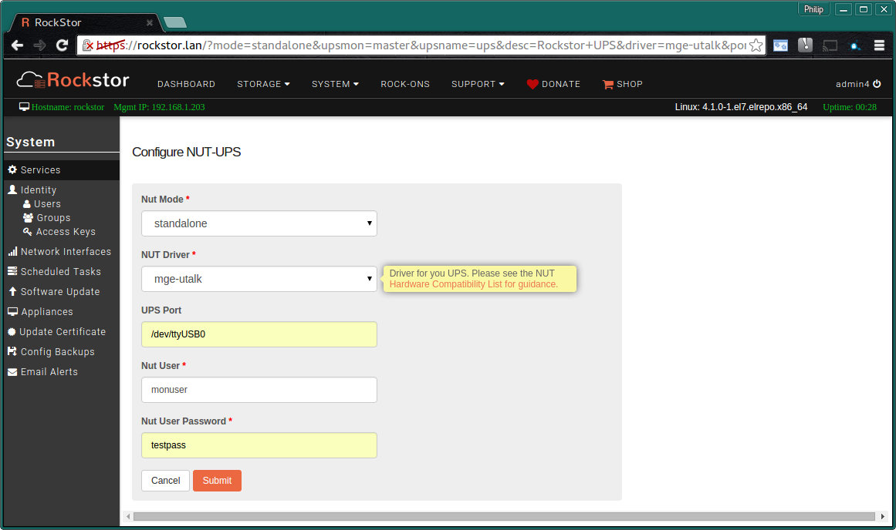
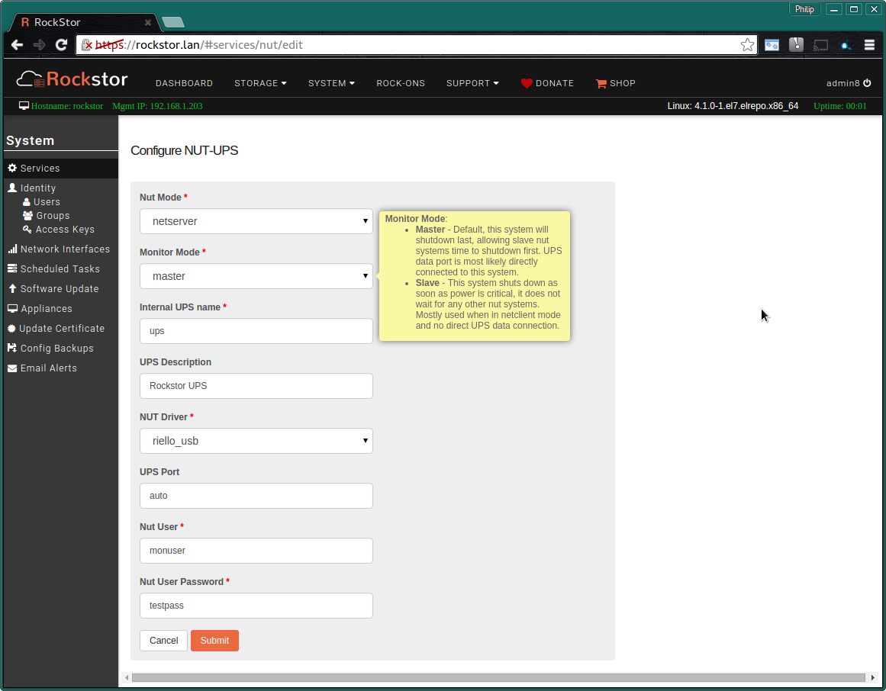
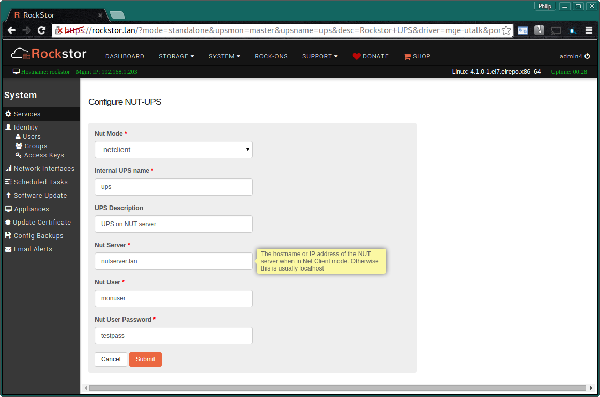

.. _ups_setup:

UPS / NUT Setup
===============

**Please note that this feature is in beta testing and not yet recommended
for production use.**

*Bug reports or suggestions are always welcome on*
`our friendly forum <http://forum.rockstor.com/>`_.

Overview
--------

Rockstor users the `NUT software collection <http://www.networkupstools.org/>`_
to orchestrate a graceful system shutdown in the presence of mains power
failure. It does this by continuously monitoring a UPS device to maintain a
knowledge of safe power conditions. In the event of those conditions changing
:ref:`email_notifications` can be sent and if the critical mains power
condition persists the system will be shutdown to avoid an otherwise
inevitable power cut affecting the system whilst in a live state. If you are
familiar with the terms UPS and NUT then please skip ahead to the
:ref:`rockstor_nut_config` section.

.. _what_is_a_ups:

What is a UPS
-------------

A **UPS** is a **Un-interruptable Power Supply** and is often associated with
mission critical electrical components such as computer servers and network
infrastructure. There function is to continue to provide mains power to the
equipment they are setup to protect in the event that the mains suffers a
blackout (mains disappears completely) or a brown out (the mains becomes sub
standard). A common facility of UPS devices is an ability to inform their
protected equipment of a critical mains event which in turn allows that
equipment to take evasive action and avoid suffering the consequences of the
power cut themselves.

In the case of servers this typically involves initiating
a safe shutdown which may also involve emailing administrative personal of the
critical event. Most domestic and pro consumer UPS's are intended to provide
mains power to their protected equipment for the duration required for this
evasive action to be taken. Care should be taken to size a UPS so that it's run
time in use is sufficient to meet this *safe shutdown* criteria.

.. _what_is_nut:

What is NUT
-----------

NUT stand for `Network UPS Tools <http://www.networkupstools.org/>`_ and is a
collection of GPLv2 licenced packages that enables communication between
UPS systems and
their protected equipment. It also has the facility to share this information
on the local lan so that equipment that is powered by the UPS but is not
directly connected to the UPS data wise can be informed of the critical mains
power events. This is particularly useful as generally in the low to mid range
of UPS's only one machine may be connected data wise to each UPS unit. With NUT
acting in :ref:`nut_netserver` it can inform any number of machines of the
critical power event. The other machines would receive this message by running
their own instance of NUT but in :ref:`nut_netclient`. Rockstor can be
configured to work in any of NUT 3 modes. The third mode is the most common
and is called :ref:`nut_standalone`. In this mode Rockstor is directly
attached to a UPS and doesn't share the mains state information it gets from
the UPS with any other machines.

.. _rockstor_nut_config:

Rockstor NUT configuration
--------------------------
Nut in Rockstor is treated as a service. Please see our :ref:`services` section
for further information. From the **System - Services** page it is possible to
turn the NUT service **ON** and **OFF** and **configure** it via it's
**spanner icon**.

Please take care to read the mouse over tips in nuts configuration screen;
the **Nut Mode** is the first option to consider in any nut configuration and
will dictate the number of other options presented.

The 3 modes are detailed in the following sections;
:ref:`nut_standalone`, :ref:`nut_netserver`, and :ref:`nut_netclient`

.. _nut_standalone:

Standalone Mode
^^^^^^^^^^^^^^^

This is the most common configuration. Rockstor is connected directly to the
data port of the UPS, usually via serial or USB connection, and doesn't share
the mains / ups data with any other machines. This mode requires the following
fields:

* **NUT Mode** - A drop down and in this case **standalone** is required
* **NUT Driver** - Please see NUT's `Hardware Compatibility List <http://www.networkupstools.org/stable-hcl.html>`_ to select the correct driver for your particular UPS make and model.
* **UPS Port** - the port name for how the UPS data cable is connected to the Rockstor machine eg - **/dev/ttyS0** for the first serial port - **/dev/ttyUSB0** for the first USB to serial port adapter - **auto** for many directly usb connected UPSs.
* **NUT User** - N.B. this is not a system user but reserved solely for NUT use.
* **NUT User Password** - A password for the above nut user.

Note in the above mouse over hint there is a web link to assist in driver
selection; repeated here for convenience:-
`Hardware Compatibility List <http://www.networkupstools.org/stable-hcl.html>`_

.. _nut_netserver:

Netserver Mode
^^^^^^^^^^^^^^

Netserver Mode is essentially identical to :ref:`nut_standalone` but with the
additional benefit of offering NUT services to other machines on the network by
way of those machines running NUT client software. In addition to the options
available in :ref:`nut_standalone` there are also the following:

* **Monitor Mode** - Select either **master** or **slave**
    - **master** - (Default) This System is most likely directly connected to the UPS; this system will shutdown last allowing slave nut systems time to shutdown first.
    - **slave** - This system will not wait for other nut clients to shutdown, UPS is most likely not directly connected to this system.
* **Internal UPS name** -  Single word ie "ups" and no special characters (" = # space, backslash). Netclient systems will use this in their nut monitor reference ie the **ups** in ups@rockstor.lan.
* **UPS Description** - Human friendly name for this UPS.

**Please note that there are additional security concerns with running nut in
netserver mode: if you are not aware of these then please use standalone mode**

Note the helpful **Monitor Mode** mouse over hint; if you are unsure which to
select then **master** is probably what you want.

.. _nut_netclient:

Netclient Mode
^^^^^^^^^^^^^^

Netclient Mode is a little different from the other two modes in that it does
not talk directly with a UPS unit but instead gains mains power status info via
another nut instance running in :ref:`nut_netserver`. Additional
configuration items to those detailed in the :ref:`nut_standalone` and
:ref:`nut_netserver` sections are detailed below:

* **Nut Server** This is the name or IP address of a lan machine running a NUT instance in :ref:`nut_netserver` mode and probably also in master monitor mode.

In the above the nut server is rather unimaginatively called nutserver on a lan
domain named using an equally imaginative scheme.
