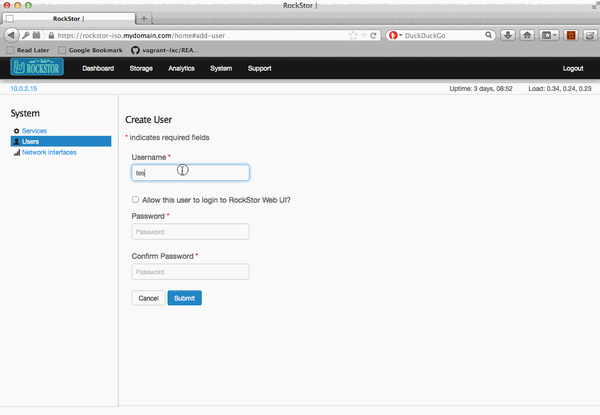
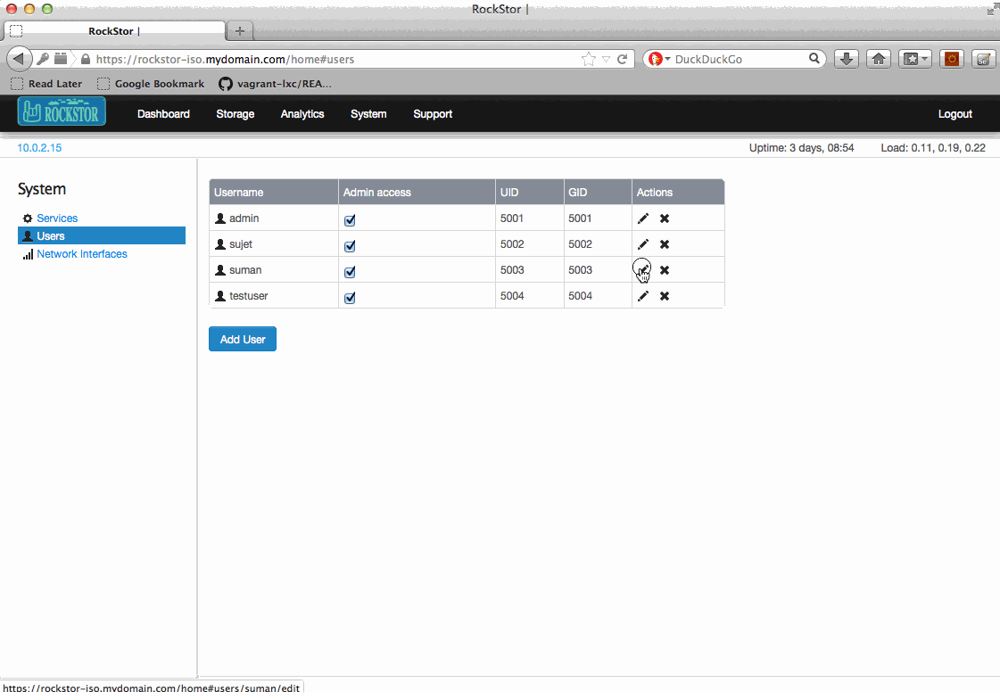

.. _users:

User configuration
==================

RockStor supports local user adds, edits and deletes. All local users added by
Rockstor have UIDs starting from 5001. If local users must be added to the
appliance, ensure that their UIDs are below 5001. Rockstor does not support
configuration of users that are not added using Rockstor user
interfaces(web-ui, CLI and API)

Users view
----------

On the web-ui, click on *System* tab to go to the *System* view. Now click on
*Users* in the left sidebar to go to the *Users* view.

Add a user
----------

On the web-ui, click on *System* tab to go to the *System* view. Now click on
*Users* in the left sidebar to go to the *Users* view. Click on the **Add
User** button and submit the form to add a new user as shown below.

If the "``Allow this user to login to RockStor Web UI``" checkbox is unchecked,
the created user will be a local system user but will not be allowed to login
to the web-ui or CLI. If it is checked, the user can login to the web-ui and CLI.

Edit a user
-----------

On the web-ui, click on *System* tab to go to the *System* view. Now click on
*Users* in the left sidebar to go to the *Users* view. To change a user's
password, click the **edit** icon next to that user in the displayed table. Submit
the form to change the password as shown below.

Delete a user
-------------

On the web-ui, click on *System* tab to go to the *System* view. Now click on
*Users* in the left sidebar to go to the *Users* view. To remove a user, click
the **Delete** icon of the corresponding user.
